# MirrorInSeconds — System Architecture

## Sequence Diagram

```mermaid
sequenceDiagram
    actor User
    participant UI as Frontend (Next.js)<br/>Railway
    participant API as Backend (Express)<br/>Railway
    participant OpenAI as OpenAI API<br/>GPT-4o-mini
    participant MongoDB as MongoDB<br/>Railway
    participant EC2 as Sandbox Engine<br/>EC2 :8080
    participant DockerNet as Docker Network<br/>on EC2
    participant SandboxMongo as Sandbox MongoDB<br/>Docker Container
    participant SandboxApp as Sandbox App<br/>Docker Container

    %% ── ONBOARD APPLICATION ──────────────────────────────────────────────────
    rect rgb(20, 30, 48)
        Note over User,MongoDB: Phase 1 — Onboard Application
        User->>UI: Enters GitHub URL + roles + DB schema
        UI->>API: POST /api/projects
        API->>OpenAI: Generate test email+password per role
        OpenAI-->>API: { admin: {email, password}, user: {email, password} }
        API->>MongoDB: Save Project (githubUrl, roles, dbSchema, roleCredentials)
        MongoDB-->>API: Project document
        API-->>UI: Project with roleCredentials
        UI-->>User: Shows project card with test credentials per role
    end

    %% ── GENERATE SCENARIO ────────────────────────────────────────────────────
    rect rgb(20, 40, 30)
        Note over User,MongoDB: Phase 2 — Generate Scenario
        User->>UI: Clicks "Generate New Scenario"<br/>Types scenario description + selects role
        UI->>API: POST /api/generatesyntheticdata<br/>{ prompt, role, dbSchema, roleCredentials }
        API->>OpenAI: Generate synthetic data matching schema<br/>with pre-assigned role credentials embedded
        OpenAI-->>API: { syntheticData: { users:[...], bookings:[...], ... } }
        API-->>UI: syntheticData
        UI->>API: POST /api/scenarios<br/>{ projectId, scenario, role, userId, userPassword, syntheticData, isLive: false }
        API->>MongoDB: Save Scenario
        MongoDB-->>API: Scenario document
        API-->>UI: Scenario (isLive: false)
        UI-->>User: Shows scenario card — status Offline
    end

    %% ── LAUNCH SANDBOX ───────────────────────────────────────────────────────
    rect rgb(40, 20, 30)
        Note over User,SandboxApp: Phase 3 — Launch Sandbox
        User->>UI: Clicks Offline toggle on scenario card
        UI->>API: POST /api/launchSandbox<br/>{ repoUrl, syntheticData }
        API->>EC2: POST http://ec2:8080/launch<br/>{ repoUrl, syntheticData }

        EC2->>DockerNet: docker network create sandbox_network
        DockerNet-->>EC2: Network ready

        EC2->>SandboxMongo: docker run mongo:7<br/>--network sandbox_network<br/>-p 127.0.0.1:0:27017
        SandboxMongo-->>EC2: Container started

        EC2->>SandboxMongo: Poll mongosh ping until ready
        SandboxMongo-->>EC2: Ready ✓

        EC2->>SandboxMongo: Connect MongoClient → insertMany(syntheticData)
        Note over EC2,SandboxMongo: Seeds users, bookings, etc.<br/>with exact test credentials from OpenAI

        EC2->>EC2: git clone --depth=1 {repoUrl}
        EC2->>EC2: Check for Dockerfile<br/>Auto-generate if missing<br/>(detects Node.js, npm scripts)
        EC2->>EC2: docker build -t {image} {clonePath}

        EC2->>SandboxApp: docker run --network sandbox_network<br/>-e MONGODB_URL=mongodb://sandbox_mongo/db<br/>-p {randomPort}:3000
        SandboxApp-->>EC2: Container started

        EC2-->>API: { status:"live", url:"http://18.x.x.x:4321" }
        API->>MongoDB: PATCH Scenario → isLive: true, url
        API-->>UI: Updated scenario
        UI-->>User: Shows scenario card — status Live + clickable URL
    end

    %% ── USE SANDBOX ──────────────────────────────────────────────────────────
    rect rgb(30, 30, 20)
        Note over User,SandboxApp: Phase 4 — Use Sandbox
        User->>SandboxApp: Opens http://18.x.x.x:4321 in browser
        Note over User,SandboxApp: Logs in with generated credentials<br/>(e.g. admin@bookings.com / Test@1234)<br/>All data is synthetic — no real APIs touched
        SandboxApp->>SandboxMongo: Reads/writes synthetic data
        SandboxMongo-->>SandboxApp: Returns seeded data
        SandboxApp-->>User: Fully functional app environment
    end
```



---

## Component Responsibilities

| Component | Host | Role |
|---|---|---|
| **Next.js Frontend** | Railway | UI — onboarding, scenario management, launch toggle |
| **Express Backend** | Railway | API — projects, scenarios, OpenAI calls, proxy to EC2 |
| **MongoDB** | Railway | Stores projects, scenarios, credentials, URLs |
| **OpenAI GPT-4o-mini** | External | Generates role credentials + synthetic data |
| **Sandbox Engine** | EC2 :8080 | Runs Docker operations — builds & starts isolated sandboxes |
| **Sandbox MongoDB** | EC2 (Docker) | Per-sandbox isolated database, seeded with synthetic data |
| **Sandbox App** | EC2 (Docker) | Cloned repo running as a container, exposed on a public port |

---

## Data Flow Summary

```
User describes scenario
        ↓
OpenAI generates realistic synthetic data
(with pre-assigned test credentials embedded in users table)
        ↓
EC2 spins up isolated MongoDB + clones repo + builds Docker image
        ↓
Synthetic data seeded into isolated MongoDB
        ↓
App container starts, connected to its own MongoDB via Docker network
        ↓
Public URL returned → QA/demo can log in with known credentials
```

---

## Key Design Decisions

- **Isolation**: Every sandbox gets its own MongoDB container and app container — no shared state between scenarios
- **No real data**: Synthetic data is AI-generated, matching exact schema, with realistic values
- **Role credentials**: OpenAI generates test email+password per role at onboarding time, embedded into synthetic data so login always works
- **Auto Dockerfile**: If the repo has no Dockerfile (or an empty one), the engine detects `package.json` and auto-generates one
- **Port range**: Sandbox containers map to ports 3001–4999 on EC2, covered by the AWS security group rule
