# MirrorInSeconds.ai — Application Architecture

```mermaid
flowchart TD
    User(["👤 User"])

    subgraph ONBOARD["🔍  Step 1 — Onboard Application"]
        direction TB
        GH["GitHub Repository URL"]
        MCP["🤖 GitHub MCP Agent\nAnalyzes codebase:\n• Detects user roles\n• Reads DB models & schemas\n• Identifies API routes\n• Finds auth patterns"]
        CREDS["🔑 OpenAI GPT-4o-mini\nGenerates realistic test\ncredentials per role\n(email + password)"]
    end

    subgraph SCENARIO["🎭  Step 2 — Define Scenario"]
        direction TB
        DESC["User describes scenario\ne.g. 'Admin approves a pending booking'"]
        SYNTH["🧠 OpenAI GPT-4o-mini\nGenerates schema-accurate\nsynthetic data\n• Matches detected DB schema\n• Embeds generated credentials\n  into users table\n• Creates realistic related records"]
    end

    subgraph STORE["🗄️  Platform Database (MongoDB on Railway)"]
        direction LR
        PROJ["Projects\n─────────\ngithubUrl\nroles\ndbSchema\nroleCredentials"]
        SCEN["Scenarios\n─────────\nprojectId\nscenario\nrole\nuserId / userPassword\nsyntheticData\nisLive / url"]
    end

    subgraph EC2["⚙️  Step 3 — Sandbox Engine (EC2)"]
        direction TB
        NET["Create isolated Docker network"]
        MONGO["Spin up MongoDB container\n(per sandbox)"]
        SEED["Seed MongoDB with\nsynthetic data"]
        CLONE["git clone repo"]
        DOCK["Auto-generate Dockerfile\nif missing"]
        BUILD["docker build image"]
        RUN["Launch app container\n+ inject MONGODB_URL"]
    end

    subgraph SANDBOX["🌐  Live Sandbox"]
        direction TB
        URL["Public URL\nhttp://ec2-ip:port"]
        LOGIN["QA / Demo User\nlogs in with generated\ncredentials"]
        APP["Fully functional app\n✓ Real UI\n✓ Synthetic data\n✓ No prod APIs touched\n✓ Fully isolated"]
    end

    User -->|"Pastes GitHub URL"| GH
    GH --> MCP
    MCP -->|"Detected roles + schema"| CREDS
    CREDS -->|"Saves project"| PROJ

    PROJ -->|"User picks role\n+ describes scenario"| DESC
    DESC --> SYNTH
    SYNTH -->|"Saves scenario\n(isLive: false)"| SCEN

    SCEN -->|"User clicks\n'Go Live'"| NET
    NET --> MONGO
    MONGO --> SEED
    SEED --> CLONE
    CLONE --> DOCK
    DOCK --> BUILD
    BUILD --> RUN

    RUN -->|"Returns URL\nPatches scenario isLive: true"| SCEN
    RUN --> URL
    URL --> LOGIN
    LOGIN --> APP

    style ONBOARD fill:#0e1a2b,stroke:#2a4a7f,color:#7eb3ff
    style SCENARIO fill:#0e2018,stroke:#2a7f4a,color:#7effa0
    style STORE fill:#1a1a0e,stroke:#7f7f2a,color:#ffff7e
    style EC2 fill:#2b0e1a,stroke:#7f2a4a,color:#ffb3d9
    style SANDBOX fill:#1a2b0e,stroke:#4a7f2a,color:#c0ff7e
```



---

## The Vision

```
GitHub URL
    │
    ▼
🤖 MCP Agent reads the repo
    ├── Scans models/ → detects DB schema (users, bookings, products…)
    ├── Scans routes/ → detects roles (admin, user, support…)
    └── Reads auth logic → understands login flow
    │
    ▼
OpenAI generates test credentials per role
(admin@app.com / Pass@123, user@app.com / Test@456)
    │
    ▼
QA team writes scenario in plain English
"An admin reviews and approves a flagged booking"
    │
    ▼
OpenAI generates synthetic data matching exact schema
with those credentials already embedded in the users table
    │
    ▼
EC2 Sandbox Engine:
  1. Spins up isolated MongoDB
  2. Seeds it with synthetic data
  3. Clones the repo
  4. Builds a Docker image
  5. Starts the app connected to that MongoDB
  6. Returns a public URL
    │
    ▼
QA / Demo user opens URL → logs in → tests the exact scenario
No real data. No real APIs. Fully isolated. Destroyed when done.
```
